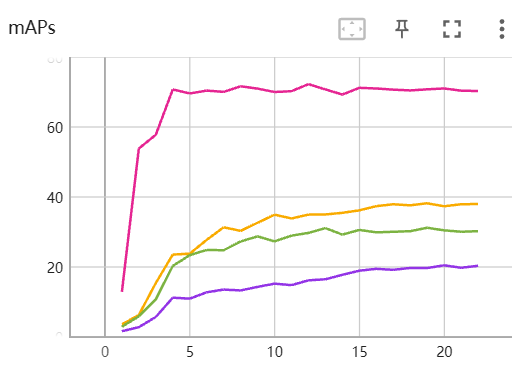
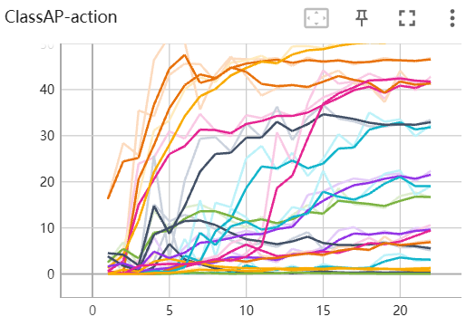
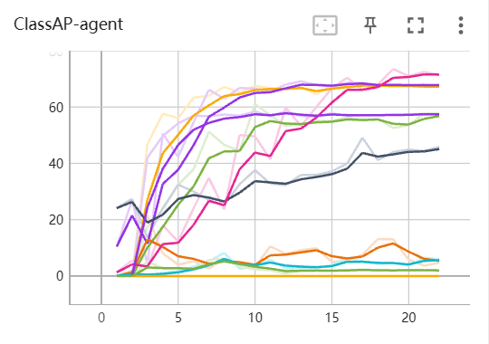
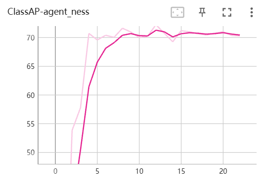
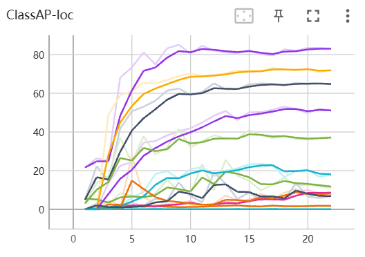

# Ensemble Method

The files in this directory are for ensembling the results of two models.

According to the experiment logs, the results are as follows:

For dinov2_swin, the best validation results are:

|              maps@50               | agent_ness |    agent    |     loc     | action  |
| :--------------------------------: | :--------: | :---------: | :---------: | :-----: |
|            TBSD (ours)             |   71.01    | 37.35~38.21 | 30.47~31.21 |  20.48  |
| only_DINOv2+3D-YOLOFPN+ours_blocks |   69.74    | 41.7~41.91  | 32.28~32.63 | / (low) |

These results show that the low action scores for only_dinov2 are due to the lack of temporally-related pretrained models and limited data (only 3 videos).

However, the model utilizes dinov2's zero-shot generalization ability well, achieving good agent and loc metrics.

Therefore, we ensemble the results to leverage the high agent and loc metrics from only_dinov2.

During experiments, using only the TBSD model (no tricks or post-processing besides NMS) achieved around 0.262 on the final evaluation.

By incorporating only_dinov2's results, this can be improved to around 0.27.

We observed that only_dinov2 has different sensitivities to agent, loc, and action classes at different epochs. Hence, we select different epochs between 1-23 for only_dinov2, and apply different nms exponents (0.6, 0.55, 0.50, 0.45, 0.42) and seq_lens (140, 120, 100, 80, 70, 40). For the tbsd model, we use combinations of different seq_len values (100, 80, 70, 40) and nms parameters. As for the only_dinov2 model, we combine seq_len values (140, 120, 100, 80, 70, 40) with the aforementioned nms parameters.

The general idea is to replace labels from lower performing epochs with those from higher performing epochs on the actual labels. In fact, our approach is somewhat intricate but highly effective. This way, we can ensure that the final outcome is the best achieved during training, not just in terms of overall performance, but also in terms of each individual category.

During training, the best metrics on the val set for different labels across epochs are approximately as follows (seq_len=8,12,16):

| action (all epoch best)            | agent (all epoch best)           | loc (all epoch best)         |
| ---------------------------------- | -------------------------------- | ---------------------------- |
| Red (51.99 only_dinov2 backbone)   | bus (73.54 tbsd)                 | bus stop (19.13 tbsd)        |
| Amber (13.31 only_dinov2 backbone) | car (69.16 tbsd)                 | incomcyclane (31.42 dinov2 ) |
| Green (35.04 tbsd)                 | cyc (63.83 only_dinov2 backbone) | incomlane (65.11 tbsd)       |
| Move Away (42.81 tbsd)             | emveh (0)                        | jun (44.15 dinov2)           |
| Move Towards (53.59 tbsd)          | larveh (8.236 tbsd)              | lftpav (73.15 tbsd)          |
| Move (12.04 only_dinov2 backbone)  | medveh (49.11 tbsd)              | outgocyclane (3.44 dinov2)   |
| ...                                | ...                              | ...                          |

We select the epochs with the best different metrics from both models, and ensemble using multi-model voting. We traverse all bboxes in the same video and frame, and if the iou overlap is greater than 0.88, we consider them the same bbox and perform ensemble (experiments on val show the iou overlap threshold affects final integration under different seq_len and nms thresholds).

The final test metrics are:

|           Method           |                Frame mAP@50                |
| :------------------------: | :----------------------------------------: |
|        TBSD (Ours)         | 0.262 (Without Any Trick/TTA/Data Augment) |
| DINOV2+3DPANFPN+Our_Blocks | 0.23 (Without Any Trick/TTA/Data Augment)  |
|     Ensemble All Epoch     |                   ~0.27                    |

The above experimental results once again demonstrate the significance of temporal information in video object detection tasks. On the validation set, even a slight decrease in action metrics can lead to a significant drop in the overall frame mAP@50 score. Therefore, enhancing the model's ability to model temporal sequences is crucial in subsequent tasks.
